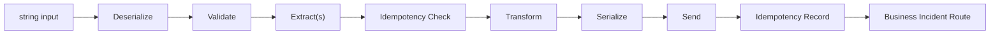

# Extractor

> A standalone pipeline that reads source data, transforms it, and publishes it as a CloudEvent.

## How it works



The Extractor is a standalone pipeline for extracting data from a source system, transforming it into a canonical model, and publishing it as a CloudEvent. It takes a `string` input, processes it through a series of typed steps, and outputs a `StepResult<CloudEvent>`.

You call the Extractor's `Execute` method directly with a string input — there is no lifecycle manager or message subscription involved. The Extractor handles its own OpenTelemetry tracing (each execution creates a detached trace), idempotency, and business incident routing.

Successful delivery returns a `CloudEvent`, which makes the Extractor well suited for publishing canonical data to topics or downstream services. Two built-in senders are included: `DaprTopicPublisher` for pub/sub and `DaprServiceInvoker` for service-to-service calls.

> [!NOTE]
> **Step namespace**
> The Extractor has its own step abstractions in
> `Intropy.Framework.Blocks.Extractor.Steps`. Make sure you import from
> this namespace — other blocks have separate step types with the same names.

## Pipeline flow

The pipeline executes in this order:

1. **Deserialize** (`string → TInput`) — Parse the raw string input into a typed object
2. **Validate** (`TInput → TInput`) — Validate the parsed object
3. **Extract** (`TInput → TInput`) — Enrich with additional data (optional, multiple allowed)
4. **Idempotency Check** (`TInput → TInput`) — Check if this data was already processed
5. **Transform** (`TInput → TOutput`) — Convert to the output model
6. **Serialize** (`TOutput → CloudEvent`) — Create a CloudEvent from the output
7. **Send** (`CloudEvent → CloudEvent`) — Publish the CloudEvent to a destination
8. **Idempotency Record** — Record that this data was processed (ordinary success-only step)
9. **Business Incident Route** — Route any business incidents (finalizer)

Each pipeline execution creates a detached OpenTelemetry trace (a new root span linked to the parent) via `PipelineTracing.ExecuteWithTracing`.

## Implementing steps

The classes below belong to a .NET 10 application with the Blocks package and implicit usings enabled. Put these imports and model/interface declarations in a source file with the step classes. `IAddressService` is an application dependency: provide its implementation (and the HTTP destination for Loader), not a framework service.

```csharp
using System.Text;
using System.Text.Json;
using System.Net.Http.Json;
using CloudNative.CloudEvents;
using CloudNative.CloudEvents.SystemTextJson;
using Dapr.Client;
using Intropy.Contracts.BusinessIncidentService;
using Intropy.Framework.Blocks.Extractor;
using Intropy.Framework.Blocks.Extractor.Steps;
using Intropy.Framework.Blocks.Shared;
using Intropy.Framework.Core.Pipeline.Abstractions;
using Intropy.Framework.Core.Pipeline.Abstractions.Results;

public record CustomerRecord(string Id, string Name, DateTimeOffset ModifiedDate, string? Address = null);
public record CanonicalCustomer(string Id, string FullName, string? NormalizedAddress, DateTimeOffset ModifiedDate);
public interface IAddressService
{
    Task<string?> LookupAsync(string id, CancellationToken ct);
}
```

These are implementation examples, not a complete host. See [Getting Started](../getting-started.md) for full TI host wiring, and [Step Types](../concepts/step-types.md) for authoritative block-qualified override contracts.

### DeserializeStep

Extends `BusinessStep<string, TInput, TCtx>`. Converts string input to your typed model:

```csharp
public class CustomerDeserializer : DeserializeStep<CustomerRecord, Context>
{
    public override Task<(BusinessStepResult<CustomerRecord> Result, Context Context)> ExecuteAsync(
        string input, Context context, CancellationToken ct)
    {
        ct.ThrowIfCancellationRequested();
        var record = JsonSerializer.Deserialize<CustomerRecord>(input)
            ?? throw new JsonException("Customer payload must not be null.");
        return Task.FromResult<(BusinessStepResult<CustomerRecord>, Context)>(
            (new BusinessStepResult<CustomerRecord>.Success(record), context));
    }
}
```

### ValidateStep

Extends `BusinessStep<T, T, TCtx>`. Same type in and out:

```csharp
public class CustomerValidator : ValidateStep<CustomerRecord, Context>
{
    public override Task<(BusinessStepResult<CustomerRecord> Result, Context Context)> ExecuteAsync(
        CustomerRecord input, Context context, CancellationToken ct)
    {
        if (string.IsNullOrEmpty(input.Name))
        {
            var incident = new BusinessIncidentData
            {
                Description = "Customer name is required",
                Context = new Dictionary<string, string> { ["customerId"] = input.Id }
            };
            return Task.FromResult<(BusinessStepResult<CustomerRecord>, Context)>(
                (new BusinessStepResult<CustomerRecord>.Failure(incident), context));
        }

        return Task.FromResult<(BusinessStepResult<CustomerRecord>, Context)>(
            (new BusinessStepResult<CustomerRecord>.Success(input), context));
    }
}
```

### ExtractStep (optional)

Extends `BusinessStep<TInput, TInput, TCtx>`. Enriches the data with information from external sources. You can add multiple extract steps:

```csharp
public class EnrichWithAddress : ExtractStep<CustomerRecord, Context>
{
    private readonly IAddressService _addressService;

    public EnrichWithAddress(IAddressService addressService) => _addressService = addressService;

    public override async Task<(BusinessStepResult<CustomerRecord> Result, Context Context)> ExecuteAsync(
        CustomerRecord input, Context context, CancellationToken ct)
    {
        var address = await _addressService.LookupAsync(input.Id, ct);
        var enriched = input with { Address = address };
        return (new BusinessStepResult<CustomerRecord>.Success(enriched), context);
    }
}
```

### TransformStep

Extends `TechnicalStep<TInput, TOutput, TCtx>`. Converts from the source model to the canonical model:

```csharp
public class CustomerTransformer : TransformStep<CustomerRecord, CanonicalCustomer, Context>
{
    public override Task<(TechnicalStepResult<CanonicalCustomer> Result, Context Context)> ExecuteAsync(
        CustomerRecord input, Context context, CancellationToken ct)
    {
        var canonical = new CanonicalCustomer(
            Id: input.Id,
            FullName: input.Name,
            NormalizedAddress: input.Address?.ToUpperInvariant(),
            ModifiedDate: input.ModifiedDate);

        return Task.FromResult<(TechnicalStepResult<CanonicalCustomer>, Context)>(
            (new TechnicalStepResult<CanonicalCustomer>.Success(canonical), context));
    }
}
```

### SerializeStep

Extends `TechnicalStep<T, CloudEvent, TCtx>`. Creates a CloudEvent from the output model. You **must** set `Subject` and `Time` on the CloudEvent — the built-in senders validate these:

```csharp
public class CustomerCloudEventSerializer : SerializeStep<CanonicalCustomer, Context>
{
    public override Task<(TechnicalStepResult<CloudEvent> Result, Context Context)> ExecuteAsync(
        CanonicalCustomer input, Context context, CancellationToken ct)
    {
        var cloudEvent = new CloudEvent
        {
            Id = Guid.NewGuid().ToString(),
            Subject = input.Id,                    // required by senders
            Time = input.ModifiedDate,             // source event time, required by senders
            Data = JsonSerializer.SerializeToElement(input),
            DataContentType = "application/json"
        };

        return Task.FromResult<(TechnicalStepResult<CloudEvent>, Context)>(
            (new TechnicalStepResult<CloudEvent>.Success(cloudEvent), context));
    }
}
```

> [!WARNING]
> **Required CloudEvent properties**
> The built-in `DaprTopicPublisher` and `DaprServiceInvoker` throw
> `InvalidOperationException` if `Subject` or `Time` is not set on the CloudEvent.
> The `Source` and `Type` are set automatically by the sender from the builder
> configuration. The serializer must also supply an event `Id` for the CloudEvent envelope.
> Use a JSON value such as `JsonElement` for JSON data, not a JSON-encoded string.

## Building an Extractor

The `ExtractorBuilder` resolves infrastructure from `IServiceProvider`. This composition fragment assumes `serviceProvider` contains the services below and `addressService` implements the interface above:

```csharp
var extractor = ExtractorBuilder<CustomerRecord, CanonicalCustomer, Context>
    .Create("customer-extractor", serviceProvider)
    .WithDeserializer(new CustomerDeserializer())
    .WithValidator(new CustomerValidator())
    .WithExtractor(new EnrichWithAddress(addressService))
    .WithTransformer(new CustomerTransformer())
    .WithSerializer(new CustomerCloudEventSerializer())
    .WithDaprTopicPublisher(
        pubSubName: "pubsub",
        topicName: "customers",
        source: new Uri("urn:company:system:crm"),
        type: "com.company.customer.extracted")
    .WithIdempotency(
        idExtractor: (record, ctx) => record.Id,
        dateExtractor: (record, ctx) => record.ModifiedDate)
    .WithBusinessIncidents(
        messageIdExtractor: ctx => ctx.Metadata["message_id"],
        subjectExtractor: ctx => ctx.Metadata["source_item_id"])
    .Build();
```

Deserializer, validator, transformer, serializer, one sender (custom or built-in), idempotency, and business incident routing are required. Extractors are optional. The builder throws `InvalidOperationException` on `Build()` if any required step is missing.

### DI requirements

The builder resolves these services from the `IServiceProvider`:

| Service | Required by | Registration |
|---------|------------|--------------|
| `ILoggerFactory` | Always | `builder.Services.AddLogging()` |
| `FrameworkOptions` | Always | `services.AddIntropyFramework(...)` |
| `DaprClient` | `WithDaprTopicPublisher` / `WithDaprServiceInvoker` | `services.AddSingleton<DaprClient>(_ => new DaprClientBuilder().Build())` |
| `IIdempotencyServiceClient` | `WithIdempotency` | Your idempotency service registration |
| `IBusinessIncidentServiceClient` | `WithBusinessIncidents` | Your business incident service registration |

## Sending CloudEvents

The Extractor offers three ways to send CloudEvents:

### Dapr topic publisher (recommended)

Publishes CloudEvents to a Dapr pub/sub topic using `DaprClient.PublishByteEventAsync`:

```csharp
.WithDaprTopicPublisher(
    pubSubName: "pubsub",
    topicName: "customers",
    source: new Uri("urn:company:system:crm"),
    type: "com.company.customer.extracted")
```

The publisher serializes the CloudEvent as `application/cloudevents+json` and publishes the bytes to the topic. It sets `Source` and `Type` from the configured values.

### Dapr service invoker

Builds a POST to another Dapr service's `"ingest"` endpoint with `DaprClient.CreateInvokeMethodRequest`, then sends it through a caller-managed `HttpClient`. Create a client for the application lifetime, outside the builder chain (for example, `using var invokeClient = DaprClient.CreateInvokeHttpClient("customer-loader");`), then configure:

```csharp
.WithDaprServiceInvoker(
    appId: "customer-loader",
    source: new Uri("urn:company:system:crm"),
    type: "com.company.customer.extracted",
    httpClientFactory: _ => invokeClient)
```

The caller owns the HTTP client lifetime; the framework does not dispose it. **Current limitation:** the built-in invoker does not check the response status, so HTTP 4xx/5xx alone do not produce a failure. If status-based failure handling is required, use a custom sender that checks it, such as the pattern below.

### Custom sender

For destinations that aren't Dapr pub/sub or service invocation, implement `SendStep<TCtx>` directly:

```csharp
public class HttpSender : SendStep<Context>
{
    private readonly HttpClient _httpClient;

    public HttpSender(HttpClient httpClient) => _httpClient = httpClient;

    public override async Task<(TechnicalStepResult<CloudEvent> Result, Context Context)> ExecuteAsync(
        CloudEvent input, Context context, CancellationToken ct)
    {
        var bytes = new JsonEventFormatter().EncodeStructuredModeMessage(input, out _);
        using var content = new ByteArrayContent(bytes.ToArray());
        content.Headers.ContentType = new System.Net.Http.Headers.MediaTypeHeaderValue("application/cloudevents+json");
        using var response = await _httpClient.PostAsync("/events", content, ct);
        response.EnsureSuccessStatusCode();

        return (new TechnicalStepResult<CloudEvent>.Success(input), context);
    }
}
```

Then use `.WithSender(new HttpSender(httpClient))` instead of the Dapr methods. Supply a BaseAddress on `httpClient` and set the event Source/Type in your serializer: a custom sender does not inherit the built-in sender configuration.

## Executing the Extractor

Call `Execute` with a string input and a fresh context. `inputString` below is the JSON string for a `CustomerRecord`. Populate stable incident identity before deserialization, since that step can fail:

```csharp
var context = new Context(new Dictionary<string, string>
{
    ["message_id"] = "msg-123",
    ["source_item_id"] = "CUST-001"
});

var (result, outputContext) = await extractor.Execute(inputString, context);

switch (result)
{
    case StepResult<CloudEvent>.Success success:
        // Published CloudEvent, or the router's default value after a handled incident
        break;
    case StepResult<CloudEvent>.Cancelled:
        // Idempotency check found this was already processed
        break;
    case StepResult<CloudEvent>.BusinessFailure bf:
        // bf.Value is BusinessIncidentData if still unhandled; successful routing returns Success
        break;
    case StepResult<CloudEvent>.Aborted:
        // Execution was aborted; the caller owns delivery/acknowledgement policy
        break;
    case StepResult<CloudEvent>.TechnicalFailure tf:
        // tf.Value is a TechnicalFailure
        break;
}
```

A successful incident route returns the router's default output, not a delivered payload. Neither this block nor its result schedules broker retries; your caller owns that policy. See [classification and handling](../concepts/result-types.md#incident-routing-and-broker-retry).

## Related

- [Transactional Integration](transactional-integration.md) — the two-pipeline alternative
- [Result Types](../concepts/result-types.md) — understanding the five result variants

Source: [Extractor.cs](../../src/Intropy.Framework.Blocks/Extractor/Extractor.cs), [ExtractorBuilder.cs](../../src/Intropy.Framework.Blocks/Extractor/ExtractorBuilder.cs), [step implementations](../../src/Intropy.Framework.Blocks/Extractor/Steps/).
