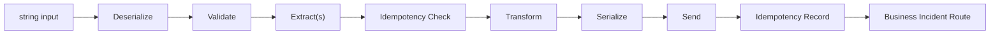

# Extractor

> A standalone pipeline that reads source data, transforms it, and publishes it as a CloudEvent.

## How it works



The Extractor is a standalone pipeline for extracting data from a source system, transforming it into a canonical model, and publishing it as a CloudEvent. It takes a `string` input, processes it through a series of typed steps, and outputs a `StepResult<CloudEvent>`.

You call the Extractor's `Execute` method directly with a string input — there is no lifecycle manager or message subscription involved. The Extractor handles its own OpenTelemetry tracing (each execution creates a detached trace), idempotency, and business incident routing.

The output is always a `CloudEvent`, which makes the Extractor well suited for publishing canonical data to topics or downstream services. Two built-in senders are included: `DaprTopicPublisher` for pub/sub and `DaprServiceInvoker` for service-to-service calls.

!!! note "Step namespace"
    The Extractor has its own step abstractions in
    `Intropy.Framework.Blocks.Extractor.Steps`. Make sure you import from
    this namespace — other blocks have separate step types with the same names.

## Pipeline flow

The pipeline executes in this order:

1. **Deserialize** (`string → TInput`) — Parse the raw string input into a typed object
2. **Validate** (`TInput → TInput`) — Validate the parsed object
3. **Extract** (`TInput → TInput`) — Enrich with additional data (optional, multiple allowed)
4. **Idempotency Check** (`TInput → TInput`) — Check if this data was already processed
5. **Transform** (`TInput → TOutput`) — Convert to the output model
6. **Serialize** (`TOutput → CloudEvent`) — Create a CloudEvent from the output
7. **Send** (`CloudEvent → CloudEvent`) — Publish the CloudEvent to a destination
8. **Idempotency Record** — Record that this data was processed (finalizer)
9. **Business Incident Route** — Route any business incidents (finalizer)

Each pipeline execution creates a detached OpenTelemetry trace (a new root span linked to the parent) via `PipelineTracing.ExecuteWithTracing`.

## Implementing steps

### DeserializeStep

Extends `BusinessStep<string, TInput, TCtx>`. Converts string input to your typed model:

```csharp
using Intropy.Framework.Blocks.Extractor.Steps;

public class CustomerDeserializer : DeserializeStep<CustomerRecord, Context>
{
    public override Task<(BusinessStepResult<CustomerRecord> Result, Context Context)> ExecuteAsync(
        string input, Context context)
    {
        var record = JsonSerializer.Deserialize<CustomerRecord>(input)!;
        return Task.FromResult<(BusinessStepResult<CustomerRecord>, Context)>(
            (new BusinessStepResult<CustomerRecord>.Success(record), context));
    }
}
```

### ValidateStep

Extends `BusinessStep<T, T, TCtx>`. Same type in and out:

```csharp
public class CustomerValidator : ValidateStep<CustomerRecord, Context>
{
    public override Task<(BusinessStepResult<CustomerRecord> Result, Context Context)> ExecuteAsync(
        CustomerRecord input, Context context)
    {
        if (string.IsNullOrEmpty(input.Name))
        {
            var incident = new BusinessIncident(
                "Customer name is required",
                DateTimeOffset.UtcNow,
                new Dictionary<string, string> { ["customerId"] = input.Id });
            return Task.FromResult<(BusinessStepResult<CustomerRecord>, Context)>(
                (new BusinessStepResult<CustomerRecord>.Failure(incident), context));
        }

        return Task.FromResult<(BusinessStepResult<CustomerRecord>, Context)>(
            (new BusinessStepResult<CustomerRecord>.Success(input), context));
    }
}
```

### ExtractStep (optional)

Extends `BusinessStep<TInput, TInput, TCtx>`. Enriches the data with information from external sources. You can add multiple extract steps:

```csharp
public class EnrichWithAddress : ExtractStep<CustomerRecord, Context>
{
    private readonly IAddressService _addressService;

    public EnrichWithAddress(IAddressService addressService) => _addressService = addressService;

    public override async Task<(BusinessStepResult<CustomerRecord> Result, Context Context)> ExecuteAsync(
        CustomerRecord input, Context context)
    {
        var address = await _addressService.LookupAsync(input.Id);
        var enriched = input with { Address = address };
        return (new BusinessStepResult<CustomerRecord>.Success(enriched), context);
    }
}
```

### TransformStep

Extends `TechnicalStep<TInput, TOutput, TCtx>`. Converts from the source model to the canonical model:

```csharp
public class CustomerTransformer : TransformStep<CustomerRecord, CanonicalCustomer, Context>
{
    public override Task<(TechnicalStepResult<CanonicalCustomer> Result, Context Context)> ExecuteAsync(
        CustomerRecord input, Context context)
    {
        var canonical = new CanonicalCustomer(
            Id: input.Id,
            FullName: input.Name,
            NormalizedAddress: input.Address?.ToUpper());

        return Task.FromResult<(TechnicalStepResult<CanonicalCustomer>, Context)>(
            (new TechnicalStepResult<CanonicalCustomer>.Success(canonical), context));
    }
}
```

### SerializeStep

Extends `TechnicalStep<T, CloudEvent, TCtx>`. Creates a CloudEvent from the output model. You **must** set `Subject` and `Time` on the CloudEvent — the built-in senders validate these:

```csharp
using CloudNative.CloudEvents;

public class CustomerCloudEventSerializer : SerializeStep<CanonicalCustomer, Context>
{
    public override Task<(TechnicalStepResult<CloudEvent> Result, Context Context)> ExecuteAsync(
        CanonicalCustomer input, Context context)
    {
        var cloudEvent = new CloudEvent
        {
            Subject = input.Id,                    // required by senders
            Time = DateTimeOffset.UtcNow,          // required by senders
            Data = JsonSerializer.Serialize(input),
            DataContentType = "application/json"
        };

        return Task.FromResult<(TechnicalStepResult<CloudEvent>, Context)>(
            (new TechnicalStepResult<CloudEvent>.Success(cloudEvent), context));
    }
}
```

!!! warning "Required CloudEvent properties"
    The built-in `DaprTopicPublisher` and `DaprServiceInvoker` throw
    `InvalidOperationException` if `Subject` or `Time` is not set on the CloudEvent.
    The `Source` and `Type` are set automatically by the sender from the builder
    configuration.

## Building an Extractor

The `ExtractorBuilder` uses `IServiceProvider` to resolve infrastructure services internally. You pass the service provider at creation time:

```csharp
var extractor = ExtractorBuilder<CustomerRecord, CanonicalCustomer, Context>
    .Create("customer-extractor", serviceProvider)
    .WithDeserializer(new CustomerDeserializer())
    .WithValidator(new CustomerValidator())
    .WithExtractor(new EnrichWithAddress(addressService))
    .WithTransformer(new CustomerTransformer())
    .WithSerializer(new CustomerCloudEventSerializer())
    .WithDaprTopicPublisher(
        pubSubName: "pubsub",
        topicName: "customers",
        source: new Uri("urn:company:system:crm"),
        type: "com.company.customer.extracted")
    .WithIdempotency(
        idExtractor: record => record.Id,
        dateExtractor: record => record.ModifiedDate)
    .WithBusinessIncidents(ctx => ctx.Metadata["message_id"])
    .Build();
```

All builder methods except `WithExtractor` and `WithSender` are required. The builder throws `InvalidOperationException` on `Build()` if any required step is missing.

### DI requirements

The builder resolves these services from the `IServiceProvider`:

| Service | Required by | Registration |
|---------|------------|--------------|
| `ILoggerFactory` | Always | `builder.Services.AddLogging()` |
| `FrameworkOptions` | Always | `services.AddIntropyFramework(...)` |
| `DaprClient` | `WithDaprTopicPublisher` / `WithDaprServiceInvoker` | `services.AddDaprClient()` |
| `IIdempotencyServiceClient` | `WithIdempotency` | Your idempotency service registration |
| `IBusinessIncidentServiceClient` | `WithBusinessIncidents` | Your business incident service registration |

## Sending CloudEvents

The Extractor offers three ways to send CloudEvents:

### Dapr topic publisher (recommended)

Publishes CloudEvents to a Dapr pub/sub topic using `DaprClient.PublishByteEventAsync`:

```csharp
.WithDaprTopicPublisher(
    pubSubName: "pubsub",
    topicName: "customers",
    source: new Uri("urn:company:system:crm"),
    type: "com.company.customer.extracted")
```

The publisher serializes the CloudEvent as `application/cloudevents+json` and publishes the bytes to the topic. It sets `Source` and `Type` from the configured values.

### Dapr service invoker

Sends CloudEvents to another Dapr service's `"ingest"` endpoint via `DaprClient.InvokeMethodAsync`:

```csharp
.WithDaprServiceInvoker(
    appId: "customer-loader",
    source: new Uri("urn:company:system:crm"),
    type: "com.company.customer.extracted")
```

The invoker creates an HTTP POST request with the CloudEvent as the body and invokes `{appId}/ingest`.

### Custom sender

For destinations that aren't Dapr pub/sub or service invocation, implement `SendStep<TCtx>` directly:

```csharp
public class HttpSender : SendStep<Context>
{
    private readonly HttpClient _httpClient;

    public HttpSender(HttpClient httpClient) => _httpClient = httpClient;

    public override async Task<(TechnicalStepResult<CloudEvent> Result, Context Context)> ExecuteAsync(
        CloudEvent input, Context context)
    {
        var json = JsonSerializer.Serialize(input);
        await _httpClient.PostAsync("/events",
            new StringContent(json, Encoding.UTF8, "application/cloudevents+json"));

        return (new TechnicalStepResult<CloudEvent>.Success(input), context);
    }
}
```

Then use `.WithSender(new HttpSender(httpClient))` instead of the Dapr methods.

## Executing the Extractor

Call `Execute` with a string input and a context:

```csharp
var context = new Context(new Dictionary<string, string>
{
    ["message_id"] = "msg-123"
});

var (result, outputContext) = await extractor.Execute(inputString, context);

switch (result)
{
    case StepResult<CloudEvent>.Success success:
        // success.Value is the published CloudEvent
        break;
    case StepResult<CloudEvent>.Cancelled:
        // Idempotency check found this was already processed
        break;
    case StepResult<CloudEvent>.BusinessFailure bf:
        // bf.Value is a BusinessIncident (routed automatically by the finalizer)
        break;
    case StepResult<CloudEvent>.TechnicalFailure tf:
        // tf.Value is a TechnicalFailure
        break;
}
```

## Related

- [Transactional Integration](transactional-integration.md) — the two-pipeline alternative
- [Result Types](../concepts/result-types.md) — understanding the four result variants
