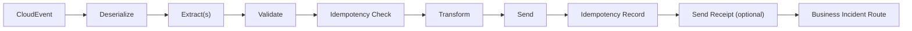

# Loader

> A standalone pipeline that receives a CloudEvent, transforms its data, and loads it into an external system.

## How it works




The Loader is a standalone pipeline for loading canonical data into a target system. It takes a `CloudEvent` as input, deserializes the payload, optionally enriches it via extract steps, validates it, transforms it to the target model, and sends it to the external system. The output is a `StepResult<TOutput>`.

You call the Loader's `Execute` method directly with a CloudEvent — there is no lifecycle manager or message subscription involved. The Loader handles its own OpenTelemetry tracing (each execution creates a detached trace), idempotency, and business incident routing.

The Loader is the natural counterpart to the Extractor: where the Extractor reads from a source and publishes CloudEvents, your host receives CloudEvents and calls the Loader to write to a target. The Loader itself does not subscribe. Together they form the two halves of a Golden Record pipeline.

> [!NOTE]
> **Step namespace**
> The Loader has its own step abstractions in
> `Intropy.Framework.Blocks.Loader.Steps`. Make sure you import from
> this namespace — other blocks have separate step types with the same names.

## Pipeline flow

The pipeline executes in this order:

1. **Deserialize** (`CloudEvent → TInput`) — Extract CloudEvent metadata to context, then deserialize the payload into a typed object
2. **Extract** (`TInput → TInput`) — Enrich with additional data (optional, multiple allowed)
3. **Validate** (`TInput → TInput`) — Validate the enriched object
4. **Idempotency Check** (`TInput → TInput`) — Check if this CloudEvent was already processed (uses `Subject` and `Time` from the CloudEvent)
5. **Transform** (`TInput → TOutput`) — Convert to the target system's model
6. **Send** (`TOutput → TOutput`) — Send the data to the external system
7. **Idempotency Record** — Record that this CloudEvent was processed (ordinary success-only step)
8. **Send Receipt** (`TOutput → TOutput`) — Send a receipt after a successful load (optional step)
9. **Business Incident Route** — Route any business incidents (finalizer)

Each pipeline execution creates a detached OpenTelemetry trace (a new root span linked to the parent) via `PipelineTracing.ExecuteWithTracing`.

## CloudEvent metadata extraction

The `DeserializeStep` automatically extracts CloudEvent metadata into the context before your deserialization logic runs. These values are available in all subsequent steps via `context.Metadata`:

| Context key | CloudEvent property | Example value |
|-------------|-------------------|---------------|
| `cloudevent.id` | `Id` | `"abc-123"` |
| `cloudevent.subject` | `Subject` | `"CUST-001"` |
| `cloudevent.time` | `Time` | `"2025-01-15T10:30:00.0000000Z"` |
| `cloudevent.source` | `Source` | `"urn:company:system:crm"` |
| `cloudevent.type` | `Type` | `"com.company.customer.extracted"` |

The idempotency checker uses `cloudevent.subject` as the ID and `cloudevent.time` as the date, so both `Subject` and `Time` must be set on the incoming CloudEvent.

## Implementing steps

The classes below belong to a .NET 10 application with the Blocks package and implicit usings enabled. Put these imports and model/interface declarations in a source file with the step classes. `IAddressService` is an application dependency: provide its implementation (and the HTTP destination for Loader), not a framework service.

```csharp
using System.Text;
using System.Text.Json;
using System.Net.Http.Json;
using CloudNative.CloudEvents;
using CloudNative.CloudEvents.SystemTextJson;
using Dapr.Client;
using Intropy.Contracts.BusinessIncidentService;
using Intropy.Framework.Blocks.Loader;
using Intropy.Framework.Blocks.Loader.Steps;
using Intropy.Framework.Blocks.Shared;
using Intropy.Framework.Core.Pipeline.Abstractions;
using Intropy.Framework.Core.Pipeline.Abstractions.Results;

public record CustomerRecord(string Id, string Name, DateTimeOffset ModifiedDate, string? Address = null);
public record CrmContact(int ExternalId, string FullName);
public record CrmCreateResponse(int Id);
public interface IAddressService
{
    Task<string?> LookupAsync(string id, CancellationToken ct);
}
```

These are implementation examples, not a complete host. See [Getting Started](../getting-started.md) for full TI host wiring, and [Step Types](../concepts/step-types.md) for authoritative block-qualified override contracts.

### DeserializeStep

Extends `BusinessStep<CloudEvent, TInput, TCtx>`. The base class `ExecuteAsync` is **sealed** — it extracts CloudEvent metadata to context automatically, then calls your `DeserializeAsync` override:

```csharp
public class CustomerDeserializer : DeserializeStep<CustomerRecord, Context>
{
    protected override Task<(BusinessStepResult<CustomerRecord> Result, Context Context)> DeserializeAsync(
        CloudEvent cloudEvent, Context context)
    {
        // This example accepts JSON objects decoded by JsonEventFormatter, or typed data.
        var record = cloudEvent.Data switch
        {
            JsonElement json => json.Deserialize<CustomerRecord>()
                ?? throw new JsonException("Customer payload must not be null."),
            CustomerRecord typed => typed,
            _ => throw new JsonException("Expected a JSON customer object.")
        };
        return Task.FromResult<(BusinessStepResult<CustomerRecord>, Context)>(
            (new BusinessStepResult<CustomerRecord>.Success(record), context));
    }
}
```

> [!WARNING]
> **Override DeserializeAsync, not ExecuteAsync**
> `ExecuteAsync` is sealed on the Loader's `DeserializeStep`. Override `DeserializeAsync`
> instead — this ensures CloudEvent metadata is always extracted before your code runs.

### ExtractStep (optional)

Extends `BusinessStep<TInput, TInput, TCtx>`. Enriches the data with information from external sources. You can add multiple extract steps — they run in the order they are registered, before validation:

```csharp
public class EnrichWithAddress : ExtractStep<CustomerRecord, Context>
{
    private readonly IAddressService _addressService;

    public EnrichWithAddress(IAddressService addressService) => _addressService = addressService;

    public override async Task<(BusinessStepResult<CustomerRecord> Result, Context Context)> ExecuteAsync(
        CustomerRecord input, Context context, CancellationToken ct)
    {
        var address = await _addressService.LookupAsync(input.Id, ct);
        var enriched = input with { Address = address };
        return (new BusinessStepResult<CustomerRecord>.Success(enriched), context);
    }
}
```

### ValidateStep

Extends `BusinessStep<T, T, TCtx>`. Same type in and out. Runs after extract steps, so you can validate enriched data:

```csharp
public class CustomerValidator : ValidateStep<CustomerRecord, Context>
{
    public override Task<(BusinessStepResult<CustomerRecord> Result, Context Context)> ExecuteAsync(
        CustomerRecord input, Context context, CancellationToken ct)
    {
        if (string.IsNullOrEmpty(input.Name))
        {
            var incident = new BusinessIncidentData
            {
                Description = "Customer name is required",
                Context = new Dictionary<string, string> { ["customerId"] = input.Id }
            };
            return Task.FromResult<(BusinessStepResult<CustomerRecord>, Context)>(
                (new BusinessStepResult<CustomerRecord>.Failure(incident), context));
        }

        return Task.FromResult<(BusinessStepResult<CustomerRecord>, Context)>(
            (new BusinessStepResult<CustomerRecord>.Success(input), context));
    }
}
```

### TransformStep

Extends `TechnicalStep<TInput, TOutput, TCtx>`. Converts from the canonical model to the target system's model:

```csharp
public class CustomerTransformer : TransformStep<CustomerRecord, CrmContact, Context>
{
    public override Task<(TechnicalStepResult<CrmContact> Result, Context Context)> ExecuteAsync(
        CustomerRecord input, Context context, CancellationToken ct)
    {
        var contact = new CrmContact(
            ExternalId: int.Parse(input.Id),
            FullName: input.Name);

        return Task.FromResult<(TechnicalStepResult<CrmContact>, Context)>(
            (new TechnicalStepResult<CrmContact>.Success(contact), context));
    }
}
```

### SendStep

Extends `TechnicalStep<T, T, TCtx>`. Sends the transformed data to the external system. The send step can enrich `TOutput` with the external system's response before returning it — this enriched version is what subsequent steps (idempotency record, receipt sender) receive:

```csharp
public class CrmApiSender : SendStep<CrmContact, Context>
{
    private readonly HttpClient _httpClient;

    public CrmApiSender(HttpClient httpClient) => _httpClient = httpClient;

    public override async Task<(TechnicalStepResult<CrmContact> Result, Context Context)> ExecuteAsync(
        CrmContact input, Context context, CancellationToken ct)
    {
        var json = JsonSerializer.Serialize(input);
        using var content = new StringContent(json, Encoding.UTF8, "application/json");
        using var response = await _httpClient.PostAsync("/api/contacts", content, ct);

        response.EnsureSuccessStatusCode();

        // Enrich TOutput with the external system's response
        var responseBody = await response.Content.ReadFromJsonAsync<CrmCreateResponse>(cancellationToken: ct);
        var enriched = input with { ExternalId = responseBody!.Id };

        return (new TechnicalStepResult<CrmContact>.Success(enriched), context);
    }
}
```

## Idempotency

The Loader's idempotency strategy is based on CloudEvent metadata, which means you don't need to provide ID or date extractors like you do with the Extractor or Send Pipeline.

The idempotency checker extracts:

- **ID** from `CloudEvent.Subject` (stored in context by `DeserializeStep`)
- **Date** from `CloudEvent.Time` (stored in context by `DeserializeStep`)
- **Hash** from the deserialized `TInput` payload

With a fresh context, missing `Subject` or `Time` causes a technical failure when execution reaches the idempotency checker. Metadata extraction only writes present attributes, so never reuse a context from an earlier event. A validation/deserialization failure may stop execution before idempotency.

### Hash generation

The hash is generated in one of three ways (in priority order):

1. **Custom hash generator** — a `Func<TInput, string>` passed to `WithIdempotency()`, used directly as the hash value
2. **`IHashable` interface** — if `TInput` implements `IHashable`, `GetHashString()` is called and SHA256-hashed and Base64-encoded
3. **Default JSON serialization** — the input is JSON-serialized and the result is SHA256-hashed and Base64-encoded

For production use, prefer option 1 or 2 for predictable, stable hashes. The default JSON serialization (option 3) is sensitive to serializer settings and property ordering, which can produce different hashes for semantically identical objects:

```csharp
// Option 1: Custom hash generator
.WithIdempotency(hashGenerator: record => $"{record.Id}|{record.Name}")

// Option 2: IHashable interface
public class HashableCustomer : IHashable
{
    public required string Id { get; init; }
    public required string Name { get; init; }
    public string GetHashString() => $"{Id}|{Name}";
}
```

## Receipt sending (optional)

After the data is loaded into the external system, the Loader can optionally send a receipt. This is useful for notifying downstream systems that a record was successfully loaded.

The receipt sender is a regular `SendStep<TOutput, TCtx>` that runs after idempotency is recorded. Because it's a pipeline step (not a finalizer), it only executes on success — if any earlier step fails, the receipt is not sent. An ordinary exception or returned technical failure in the receipt sender produces `TechnicalFailure`. Because idempotency was already recorded, a retry may be cancelled before reaching the receipt sender. This is not guaranteed receipt delivery; use a separate durable delivery design when required.

```csharp
.WithReceiptSender(new LoadReceiptPublisher(daprClient))
```

The receipt sender receives the `TOutput` that came out of the send step. If the send step enriched the output with the external system's response (e.g., an assigned external ID), the receipt sender sees that enriched version. This means the receipt can include information from the external system's response without any extra wiring.

```csharp
public class LoadReceiptPublisher : SendStep<CrmContact, Context>
{
    private readonly DaprClient _daprClient;

    public LoadReceiptPublisher(DaprClient daprClient) => _daprClient = daprClient;

    public override async Task<(TechnicalStepResult<CrmContact> Result, Context Context)> ExecuteAsync(
        CrmContact input, Context context, CancellationToken ct)
    {
        // input.ExternalId was set by the send step from the CRM API response
        var cloudEvent = new CloudEvent
        {
            Id = Guid.NewGuid().ToString(),
            Subject = input.ExternalId.ToString(),
            Time = DateTimeOffset.UtcNow,
            Source = new Uri("urn:company:system:loader"),
            Type = "com.company.contact.loaded",
            Data = JsonSerializer.SerializeToElement(input),
            DataContentType = "application/json"
        };

        var bytes = new JsonEventFormatter().EncodeStructuredModeMessage(cloudEvent, out _);
        await _daprClient.PublishByteEventAsync("pubsub", "load-receipts", bytes,
            "application/cloudevents+json", cancellationToken: ct);

        return (new TechnicalStepResult<CrmContact>.Success(input), context);
    }
}
```

## Building a Loader

The `LoaderBuilder` resolves infrastructure from `IServiceProvider`. This composition fragment assumes `serviceProvider` contains the services below, `addressService` implements the interface above, `httpClient` targets your CRM API, and `daprClient` is a configured Dapr client for optional receipts:

```csharp
var loader = LoaderBuilder<CustomerRecord, CrmContact, Context>
    .Create("customer-loader", serviceProvider)
    .WithDeserializer(new CustomerDeserializer())
    .WithExtractor(new EnrichWithAddress(addressService))
    .WithValidator(new CustomerValidator())
    .WithIdempotency()
    .WithTransformer(new CustomerTransformer())
    .WithSender(new CrmApiSender(httpClient))
    .WithBusinessIncidents(
        messageIdExtractor: ctx => ctx.Metadata[CloudEventContextKeys.Id],
        subjectExtractor: ctx => ctx.Metadata[CloudEventContextKeys.Subject])
    // Optional receipt sending:
    .WithReceiptSender(new LoadReceiptPublisher(daprClient))
    .Build();
```

Deserializer, validator, transformer, sender, idempotency, and business incident routing are required. Extractors and the receipt sender are optional. The builder throws `InvalidOperationException` on `Build()` if any required step is missing.

### DI requirements

The builder resolves these services from the `IServiceProvider`:

| Service | Required by | Registration |
|---------|------------|--------------|
| `ILoggerFactory` | Always | `builder.Services.AddLogging()` |
| `FrameworkOptions` | Always | `services.AddIntropyFramework(...)` |
| `IIdempotencyServiceClient` | `WithIdempotency` | Your idempotency service registration |
| `IBusinessIncidentServiceClient` | `WithBusinessIncidents` | Your business incident service registration |

## Executing the Loader

Call `Execute` with a valid CloudEvent (including Id, Subject, Time, Source, and Type) and a fresh context. The composition below assumes `cloudEvent` was decoded by a CloudEvent-aware transport, not generic JSON model binding:

```csharp
var context = new Context(new Dictionary<string, string>());

var (result, outputContext) = await loader.Execute(cloudEvent, context);

switch (result)
{
    case StepResult<CrmContact>.Success success:
        // Sent object, or default(TOutput) after a handled incident
        break;
    case StepResult<CrmContact>.Cancelled:
        // Idempotency check found this CloudEvent was already processed
        break;
    case StepResult<CrmContact>.BusinessFailure bf:
        // bf.Value is BusinessIncidentData if still unhandled; successful routing returns Success
        break;
    case StepResult<CrmContact>.Aborted:
        // Execution was aborted; the caller owns delivery/acknowledgement policy
        break;
    case StepResult<CrmContact>.TechnicalFailure tf:
        // tf.Value is a TechnicalFailure
        break;
}
```

A successful incident route returns the router's default output, not a delivered payload. Neither this block nor its result schedules broker retries; your caller owns that policy. See [classification and handling](../concepts/result-types.md#incident-routing-and-broker-retry).

## Related

- [Extractor](extractor.md) — the counterpart that publishes CloudEvents from a source system
- [Transactional Integration](transactional-integration.md) — the two-pipeline alternative with receive and send
- [Result Types](../concepts/result-types.md) — understanding the five result variants

Source: [Loader.cs](../../src/Intropy.Framework.Blocks/Loader/Loader.cs), [LoaderBuilder.cs](../../src/Intropy.Framework.Blocks/Loader/LoaderBuilder.cs), [step implementations](../../src/Intropy.Framework.Blocks/Loader/Steps/).
