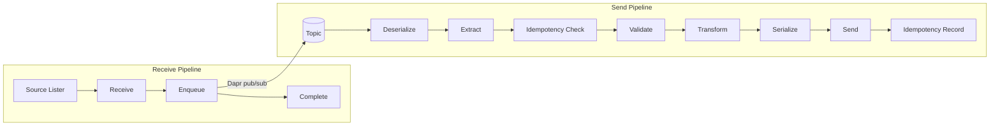

# Transactional Integration

> A two-pipeline system that reads source items, publishes them to Dapr pub/sub, and processes them through a send pipeline.

## How it works



The Transactional Integration (TI) follows a classic reliable messaging pattern: receive a message from the source, publish it to an internal queue, then process it from that queue. The queue acts as a safety net — if processing fails, the message stays on the queue and can be retried without having to re-fetch it from the source system.

This matters because source systems are often unreliable or have side effects on read (e.g., SFTP servers where you delete the file after reading, APIs with pagination cursors that expire). By immediately enqueuing the raw data and completing the source transaction (deleting the file, acknowledging the read), you decouple the reliability of receiving from the reliability of processing. The source is only touched once, and all retries happen against the internal queue.

In practice, this means the TI has two pipelines connected by Dapr pub/sub:

- The **receive pipeline** reads items from the source, publishes each one to a Dapr topic, then cleans up the source (e.g., deletes the file).
- The **send pipeline** subscribes to the topic and processes each message through deserialization, validation, transformation, serialization, and sending to the destination.

If the send pipeline fails for a message, the message remains on the topic for automatic retry. The source system is not involved in retries.

## Lifecycle

The `TransactionalIntegrationRunner` orchestrates the full lifecycle:

1. Waits for the Dapr sidecar to be ready
2. Starts the receive pipeline (publisher) and send pipeline (subscriber) concurrently
3. The publisher lists source items via `ISourceLister`, processes each through the receive pipeline
4. The subscriber subscribes to the Dapr topic, processes messages through the send pipeline
5. After the publisher finishes and an idle timeout elapses, the subscriber shuts down
6. The Dapr sidecar is shut down

```csharp
var runner = app.Services.GetRequiredService<TransactionalIntegrationRunner>();
var exitCode = await runner.RunAsync(); // returns 0 on success, 1 on failure
```

## Configuration

`TransactionalIntegrationOptions` controls the lifecycle behavior:

```csharp
builder.Services.AddTransactionalIntegration(opts =>
{
    opts.DaprPubSubName = "pubsub";          // required
    opts.DaprTopicName = "orders";           // required
    opts.IdleTimeoutSeconds = 5;             // default: 5
    opts.PostIdleGracePeriodSeconds = 45;    // default: 45
    opts.MaxMessageProcessingTimeSeconds = 40; // default: 40
    opts.SidecarTimeoutSeconds = 30;         // default: 30
});
```

| Option | Description |
|--------|-------------|
| `DaprPubSubName` | Name of the Dapr pub/sub component |
| `DaprTopicName` | Topic to publish/subscribe to |
| `IdleTimeoutSeconds` | Seconds of inactivity before the subscriber considers itself idle |
| `PostIdleGracePeriodSeconds` | Seconds to wait after idle before shutting down |
| `MaxMessageProcessingTimeSeconds` | Maximum time a single message can take before timeout |
| `SidecarTimeoutSeconds` | Maximum time to wait for the Dapr sidecar to become ready |

## Receive pipeline

The receive pipeline has three steps:

### ISourceLister

Lists available source items. This is an interface — not a step — that you implement:

```csharp
public class FileSourceLister(IFileAdapter fileAdapter) : ISourceLister
{
    public async Task<List<SourceItemInfo>> ListSourceItemsAsync()
    {
        var files = await fileAdapter.ListAsync();
        return files.Select(f => new SourceItemInfo(f.FileName)).ToList();
    }
}
```

`SourceItemInfo` is a record with a single `Id` property that identifies the source item.

### ReceiveStep

Reads the content for a source item. Extends `BusinessStep<SourceItemInfo, SourceItem, TCtx>`:

```csharp
public class FileReceiver(IFileAdapter fileAdapter) : ReceiveStep<Context>
{
    public override async Task<(BusinessStepResult<SourceItem> Result, Context Context)> ExecuteAsync(
        SourceItemInfo input, Context context)
    {
        var content = await fileAdapter.GetContentAsync(input.Id);
        return (new BusinessStepResult<SourceItem>.Success(new SourceItem(input.Id, content)), context);
    }
}
```

`SourceItem` contains the `Id` and the raw `byte[]` data.

### EnqueueStep

Publishes the source item to the Dapr topic as a cloud event. Extends `TechnicalStep<SourceItem, SourceItem, TCtx>`. The base class `ExecuteAsync` is **sealed** — it automatically adds `Context.Metadata` and the current W3C trace parent to the cloud event. You implement the overload that receives `cloudEvent`:

```csharp
public class DaprEnqueuer(DaprClient daprClient, FrameworkOptions options) : EnqueueStep<Context>(options)
{
    public override async Task<(TechnicalStepResult<SourceItem> Result, Context Context)> ExecuteAsync(
        SourceItem input, ReadOnlyMemory<byte> cloudEvent, TCtx context)
    {
        await daprClient.PublishByteEventAsync(
            pubsubName: options.DaprPubSubName,
            topicName: options.DaprTopicName,
            data: cloudEvent,
            dataContentType: "application/cloudevents+json" 
                
        return (new TechnicalStepResult<SourceItem>.Success(input), context);
    }
}
```

### CompleteStep

Handles cleanup after successful enqueue. Extends `BusinessStep<SourceItem, SourceItem, TCtx>`:

```csharp
public class FileCompleter(IFileAdapter fileAdapter) : CompleteStep<Context>
{
    public override async Task<(BusinessStepResult<SourceItem> Result, Context Context)> ExecuteAsync(
        SourceItem input, Context context)
    {
        await fileAdapter.DeleteAsync(input.Id);
        return (new BusinessStepResult<SourceItem>.Success(input), context);
    }
}
```

### Registration

```csharp
builder.Services.AddReceivePipeline<Context>("order-receive",
    (pipelineBuilder, sp) => pipelineBuilder
        .WithReceiver(new FileReceiver(sp.GetRequiredService<IFileAdapter>()))
        .WithEnqueuer(new DaprEnqueuer(sp.GetRequiredService<DaprClient>()))
        .WithCompleter(new FileCompleter(sp.GetRequiredService<IFileAdapter>()))
        .WithBusinessIncidents(
            sp.GetRequiredService<IBusinessIncidentServiceClient>(),
            ctx => ctx.Metadata["message_id"]));
```

## Send pipeline

The send pipeline has six required steps plus optional extractors. See [Getting Started](../getting-started.md) for a complete example.

Pipeline flow: `ReadOnlyMemory<byte>` → Deserialize → Extract(s) → Idempotency Check → Validate → Transform → Serialize → Send → Idempotency Record → Business Incident Route

### Registration

```csharp
builder.Services.AddSendPipeline<Order, Invoice, Context>("order-send",
    (pipelineBuilder, sp) => pipelineBuilder
        .WithDeserializer(new OrderDeserializer())
        .WithExtractor(new EnrichWithCustomerData())  // optional, can call multiple times
        .WithValidator(new OrderValidator())
        .WithIdempotency(
            sp.GetRequiredService<IIdempotencyServiceClient>(),
            order => order.OrderId,
            order => order.CreatedAt)
        .WithTransformer(new OrderToInvoiceTransformer())
        .WithSerializer(new InvoiceSerializer())
        .WithSender(new InvoiceApiSender())
        .WithBusinessIncidents(
            sp.GetRequiredService<IBusinessIncidentServiceClient>(),
            ctx => ctx.Metadata["message_id"]));
```

## Context propagation

The TI automatically propagates `Context.Metadata` and W3C trace context through Dapr CloudEvent extensions. When the send pipeline receives a message, the metadata and trace parent from the receive pipeline are restored automatically. This means the send pipeline's trace is linked to the receive pipeline's trace, and any metadata you set in the receive pipeline (like file names or batch IDs) is available in the send pipeline.

## Related

- [Getting Started](../getting-started.md) — complete working example
- [Builders API Reference](../core/builders.md) — exact builder method signatures
- [File Adapters](../adapters/file-adapters.md) — SFTP, local, and Azure Blob Storage adapters
