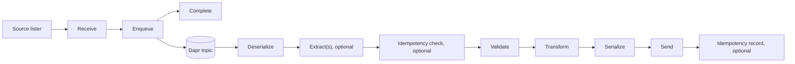

# Transactional Integration

> Two pipelines connected by Dapr pub/sub: receive source items, then process their payloads at the destination.

The pipelines live in **Blocks**. The job lifecycle, options, and runner live in **Hosting**, under `Intropy.Framework.Hosting.TransactionalIntegration.Job`. This page describes the current source; use the corresponding release docs for installed packages.

## How it works



Receive and send can each have an optional business-incident finalizer. The receive pipeline's completion step runs after successful enqueue, **not** after destination delivery.

This decouples source access from downstream processing, but is not an atomic transaction or an exactly-once guarantee. A crash between enqueue and cleanup can republish a source item; a destination write followed by a failed idempotency record can repeat a side effect. Source cleanup, destination deduplication, and broker retention/redelivery policies remain application concerns.

## Lifecycle

`TransactionalIntegrationRunner.RunAsync()`:

1. Waits for the Dapr sidecar, bounded by `SidecarTimeoutSeconds`.
2. Starts publishing and subscribing concurrently.
3. Lists source items once and runs the receive pipeline sequentially for each item.
4. Processes subscribed messages through the send pipeline.
5. Starts idle monitoring only after publishing completes. Once idle, waits up to the grace period for in-flight handlers before disposing the subscription.
6. Attempts to shut down the sidecar after lifecycle execution, even if the lifecycle throws. A failure while initially waiting for the sidecar returns before this shutdown block.

`RunAsync()` returns `1` for sidecar-wait failures or exceptions escaping the lifecycle, otherwise `0`. **A zero exit code does not prove every item was delivered:** returned receive failures are logged and the loop continues; per-message send failures are handled through broker responses. Monitor those outcomes separately.

The runner does not take a cancellation token. It owns sidecar shutdown, so use it for a dedicated job sidecar rather than one shared by unrelated workloads.

## Configuration

**Namespace:** `Intropy.Framework.Hosting.TransactionalIntegration.Job`

**Assembly:** `Intropy.Framework.Hosting`

Registration fragment (the complete host is in [Getting Started](../getting-started.md)):

```csharp
builder.Services.AddTransactionalIntegration(opts =>
{
    opts.DaprPubSubName = "pubsub";
    opts.DaprTopicName = "orders";
});
```

| Option | Default | Meaning |
|---|---|---|
| `DaprPubSubName` | `""` | Pub/sub component name; non-empty required |
| `DaprTopicName` | `""` | Subscription topic; non-empty required |
| `IdleTimeoutSeconds` | `5` | Inactivity threshold, monitored after publishing completes |
| `PostIdleGracePeriodSeconds` | `45` | Maximum wait for in-flight messages after idle, not an unconditional delay |
| `MaxMessageProcessingTimeSeconds` | `40` | Processing timeout passed to the Dapr subscription; cancellation is cooperative |
| `SidecarTimeoutSeconds` | `30` | Maximum initial sidecar wait |

Options have mutable properties and both a parameterless constructor and `TransactionalIntegrationOptions(string daprPubSubName, string daprTopicName)`. Registration immediately checks the two required names; it does not validate numeric ranges. Keep processing timeout below the grace period and choose positive values appropriate to the workload.

`AddTransactionalIntegration` registers options, `ITopicSubscriber`, `TransactionalIntegrationLifecycle`, and `TransactionalIntegrationRunner`. The lifecycle constructs its internal subscriber/idle machinery; these are not all separately registered services.

You must supply `ILoggerFactory`, `FrameworkOptions`, `DaprClient`, `DaprPublishSubscribeClient`, `ISourceLister`, `IReceivePipeline<Context>`, and `ISendPipeline<Context>`. The built-in host uses **exactly `Context`**; registering pipelines only for a derived context does not satisfy it. See [builder registration](../core/builders.md) for pipeline singleton lifetimes.

## Receive pipeline

Three required steps execute in order: Receive → Enqueue → Complete. Incident routing is optional. Follow the [walkthrough](../getting-started.md#implement-the-receive-pipeline) for complete implementations; exact overrides are in the [block step matrix](../concepts/step-types.md#transactional-integration--receive-pipeline).

### ISourceLister

`ISourceLister.ListItemsAsync(CancellationToken cancellationToken = default)` returns `Task<IReadOnlyList<SourceItemInfo>>`. It is not a pipeline step. `SourceItemInfo` contains the string `Id`. The current lifecycle calls it without a cancellation token.

### ReceiveStep

Business step: `SourceItemInfo` → `SourceItem`. `SourceItem` holds a string `Id` and raw `byte[] Data`. The host starts each item with fresh metadata containing `sourceItemId`.

### EnqueueStep

Technical step with a `FrameworkOptions` constructor dependency. Its ordinary override is sealed: it wraps the source bytes in a structured CloudEvent, adds serialized metadata and trace extensions, and calls your four-parameter overload with the encoded bytes. Publish **those bytes**, with content type `application/cloudevents+json`, rather than republishing `input.Data`.

The envelope has a newly generated ID and type `transactional-integration.received`. Do not assume it supplies the Subject/Time contract used by Loader; TI sends raw payload bytes to its own send pipeline.

### CompleteStep

Business step: `SourceItem` → `SourceItem`. Delete or archive the source only after successful enqueue. Failure or interruption can leave the item available for the next job; make republishing safe.

### Registration

See [receive registration in Getting Started](../getting-started.md#register-the-receive-pipeline). Receiver, enqueuer, and completer are required. External or custom business incident routing is optional. Receive-side incident extractors must work with `sourceItemId`; the initial receive context does not contain `message_id`.

## Send pipeline

Five required steps: deserialize, validate, transform, serialize, and send. Extractors, idempotency check/record, and incident routing are optional.

Execution order is fixed, independent of builder call order:

`ReadOnlyMemory<byte>` → Deserialize → Extract(s) → Idempotency Check → Validate → Transform → Serialize → Send → Idempotency Record → Business Incident Route

The idempotency recorder is an ordinary success-only step, not a finalizer. TI's `SendStep` is **business**, unlike Extractor/Loader senders. See [failure domains](../concepts/step-types.md).

### Registration

See [send registration in Getting Started](../getting-started.md#register-the-send-pipeline) and the [builder reference](../core/builders.md). Pipelines are built on service resolution; omitted required steps fail there, not necessarily when registration is called.

## Context propagation

Enqueue serializes `Context.Metadata` into the CloudEvent `metadata` extension and propagates W3C trace information. The subscriber restores the metadata into a fresh context and adds `ContextKeys.MessageId` (`message_id`) from the envelope ID if not already present. `IsRetry` is true when a `retrycount` extension exists, not based on a numeric comparison.

Each message needs its own mutable metadata dictionary. A source-file retry creates a new envelope ID unless the application carries a stable message ID in metadata. Choose incident/idempotency identifiers deliberately.

## Results and redelivery

The subscriber requests retry for final technical failures **and unhandled business failures**. Successfully routed business incidents become success; `Cancelled` and, currently, `Aborted` are acknowledged as success too. Exceptions escaping processing request retry. Actual redelivery depends on Dapr and the broker.

Use the canonical [incident routing and broker retry table](../concepts/result-types.md#incident-routing-and-broker-retry). Do not interpret a handled incident as successful destination delivery, or rely on execution abortion to request retry.

## Related

- [Getting Started](../getting-started.md) — complete application walkthrough
- [Builders API Reference](../core/builders.md) — required/optional slots and callback signatures
- [File Adapters](../adapters/file-adapters.md) — Dapr-backed source/destination access
- [Lifecycle source](../../src/Intropy.Framework.Hosting/TransactionalIntegration/Job/Lifecycle/TransactionalIntegrationLifecycle.cs)
- [Runner source](../../src/Intropy.Framework.Hosting/TransactionalIntegration/Job/TransactionalIntegrationRunner.cs)
- [Options source](../../src/Intropy.Framework.Hosting/TransactionalIntegration/Job/TransactionalIntegrationOptions.cs)
