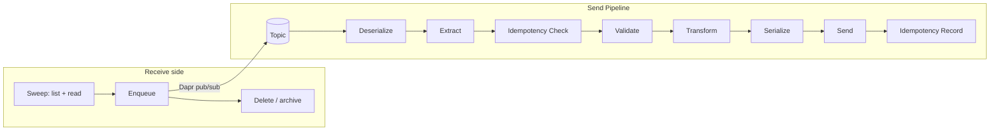

# Transactional Integration

> A two-pipeline system that reads source items, publishes them to Dapr pub/sub, and processes them through a send pipeline.

## How it works


```mermaid
graph LR
    subgraph Receive side
        SW[Sweep: list + read] --> E[Enqueue]
        E --> C[Delete / archive]
    end

    E -->|Dapr pub/sub| D[(Topic)]

    subgraph Send Pipeline
        D --> DS[Deserialize]
        DS --> EX[Extract]
        EX --> IC[Idempotency Check]
        IC --> V[Validate]
        V --> T[Transform]
        T --> S[Serialize]
        S --> SD[Send]
        SD --> IR[Idempotency Record]
    end
```

The Transactional Integration (TI) follows a classic reliable messaging pattern: receive a message from the source, publish it to an internal queue, then process it from that queue. The queue acts as a safety net — if processing fails, the message stays on the queue and can be retried without having to re-fetch it from the source system.

This matters because source systems are often unreliable or have side effects on read (e.g., SFTP servers where you delete the file after reading, APIs with pagination cursors that expire). By immediately enqueuing the raw data and completing the source transaction (deleting the file, acknowledging the read), you decouple the reliability of receiving from the reliability of processing. The source is only touched once, and all retries happen against the internal queue.

In practice, this means the TI has two pipelines connected by Dapr pub/sub:

- The **receive side** is owned by the framework: it sweeps the source, publishes each file to a Dapr topic, then cleans up the source (e.g., deletes the file).
- The **send pipeline** subscribes to the topic and processes each message through deserialization, validation, transformation, serialization, and sending to the destination.

If the send pipeline fails for a message, the message remains on the topic for automatic retry. The source system is not involved in retries.

## Lifecycle

The lifecycle is a run-to-completion job, hosted by the same `JobRunner` as the extractor:

1. Waits for the Dapr sidecar to be ready
2. Starts the receive pipeline (publisher) and send pipeline (subscriber) concurrently
3. The publisher sweeps the source (`FileSweep`): each file is read, published through the receive pipeline, and only then deleted or archived
4. The subscriber subscribes to the Dapr topic, processes messages through the send pipeline
5. After the publisher finishes and an idle timeout elapses — or the host cancels — the subscriber drains in-flight messages and shuts down
6. The Dapr sidecar is shut down

```csharp
// Starts the host, runs the job, then stops and disposes the host (flushing telemetry).
return await app.RunToCompletionAsync(ct); // 0 success or host cancellation; 1 failure, files left in place, or messages left for redelivery; 2 sidecar unavailable or host failed to start
```

## Configuration

`TransactionalIntegrationOptions` controls the lifecycle behavior:

The swept port is registered on its own, with its file adapter configured under `Ports:<port>`:

```csharp
builder.Services.AddSourcePort("order-source", builder.Configuration); // optional third argument: FileCompletion.Archive("archive")
```

```csharp
builder.Services.AddTransactionalIntegration(opts =>
{
    opts.DaprPubSubName = "pubsub";          // required
    opts.DaprTopicName = "orders";           // required
    opts.IdleTimeout = TimeSpan.FromSeconds(5);      // default: 5 seconds
    opts.PostIdleGracePeriod = TimeSpan.FromSeconds(45); // default: 45 seconds
    opts.MaxMessageProcessingTime = TimeSpan.FromSeconds(40); // default: 40 seconds
}, job =>
{
    job.JobName = "order-processor";         // default: the component name (the trace activity name)
    job.SidecarTimeout = TimeSpan.FromSeconds(30);   // default: 30 seconds
});
```

| Option | Description |
|--------|-------------|
| `DaprPubSubName` | Name of the Dapr pub/sub component |
| `DaprTopicName` | Topic to publish/subscribe to |
| `IdleTimeout` | Time of inactivity before the subscriber considers itself idle |
| `PostIdleGracePeriod` | Time to wait after idle before shutting down |
| `MaxMessageProcessingTime` | Maximum time a single message can take before timeout |

The optional second delegate configures the shared `JobOptions`: `JobName`, `SidecarTimeout`, and `SidecarShutdownTimeout`.

Pipelines use the base `Context` by default. To use your own context type in both pipelines, pass a
`ContextFactory<TCtx>`, the same factory shape extractors use:

```csharp
builder.Services.AddTransactionalIntegration<OrderContext>(
    (metadata, isRetry) => new OrderContext(metadata, isRetry),
    opts => { /* as above */ });
```

The factory is called once per source file (metadata holds `file_name`) and once per message
(metadata holds what the receive side propagated, plus the message id; `isRetry` is set on
redelivery). Register `ISendPipeline<OrderContext>`; the receive side is registered for you.

## Receive side

The receive side needs no component code. The lifecycle sweeps the source with `FileSweep` (from
`Intropy.Framework.Adapters`): it lists the keyed `IFileAdapter`, reads each file into a
`SourceItem` (`Id` plus raw `byte[]` data), runs the receive pipeline in the file's own scope, and
completes the file only after the pipeline succeeded. A file that cannot be read or published stays
for the next run and fails the run (exit 1). Each file gets a fresh `Context` with the file name in
its metadata under `SourceContextKeys.FileName` (`"file_name"`).

`AddTransactionalIntegration` registers the receive pipeline. Its one step is a
`DaprTopicEnqueuer<TCtx>`, which publishes each item to `DaprPubSubName` / `DaprTopicName` as a
structured CloudEvent (`application/cloudevents+json`). The envelope carries `Context.Metadata` and
the current W3C trace parent, so the send pipeline's context and trace continue from the file.

Both are registered only when absent:

```csharp
// Replace the publisher, e.g. with the testing fake:
services.AddSingleton<EnqueueStep<Context>>(new FakeEnqueueStep<Context>(frameworkOptions));

// Or replace the whole receive pipeline:
services.AddReceivePipeline<Context>("order-receive",
    (pipelineBuilder, sp) => pipelineBuilder.WithEnqueuer(sp.GetRequiredService<EnqueueStep<Context>>()));
```

## Send pipeline

The send pipeline has six required steps plus optional extractors. See [Getting Started](../getting-started.md) for a complete example.

Pipeline flow: `ReadOnlyMemory<byte>` → Deserialize → Extract(s) → Idempotency Check → Validate → Transform → Serialize → Send → Idempotency Record → Business Incident Route

### Registration

```csharp
builder.Services.AddSendPipeline<Order, Invoice, Context>("order-send",
    (pipelineBuilder, sp) => pipelineBuilder
        .WithDeserializer(new OrderDeserializer())
        .WithExtractor(new EnrichWithCustomerData())  // optional, can call multiple times
        .WithValidator(new OrderValidator())
        .WithIdempotency(
            sp.GetRequiredService<IIdempotencyServiceClient>(),
            order => order.OrderId,
            order => order.CreatedAt)
        .WithTransformer(new OrderToInvoiceTransformer())
        .WithSerializer(new InvoiceSerializer())
        .WithSender(new InvoiceApiSender())
        .WithBusinessIncidents(
            sp.GetRequiredService<IBusinessIncidentServiceClient>(),
            ctx => ctx.Metadata["message_id"]));
```

## Context propagation

The TI automatically propagates `Context.Metadata` and W3C trace context through Dapr CloudEvent extensions. When the send pipeline receives a message, the metadata and trace parent from the receive pipeline are restored automatically. The receive side publishes under a `send {topic}` producer span, and the send side processes each message under a `process {topic}` consumer span that continues it, so one file is one trace from the source to the send pipeline. Each consumer span is also linked to the span of the run that consumed it. Any metadata you set in the receive pipeline (like file names or batch IDs) is available in the send pipeline.

## Related

- [Getting Started](../getting-started.md) — complete working example
- [Builders API Reference](../core/builders.md) — exact builder method signatures
- [File Adapters](../adapters/file-adapters.md) — SFTP, local, and Azure Blob Storage adapters
