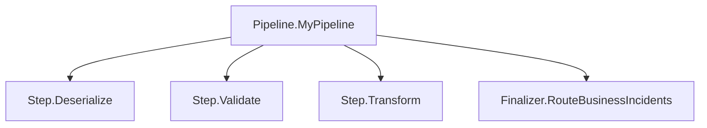

# Observability

> Pipeline wrappers emit Activity spans; configure an Activity listener or OpenTelemetry exporter to collect them.

## How it works



The framework creates OpenTelemetry `Activity` spans at two levels: one for the entire pipeline and one for each individual step. The wrappers request spans automatically; without an interested listener, `StartActivity` can return null. Direct calls to your `ExecuteAsync` override bypass these wrappers.

## Pipeline-level tracing

Wrap any pipeline with `PipelineTracing.ExecuteWithTracing` to create a parent span:

```csharp
var (result, context) = await PipelineTracing.ExecuteWithTracing(
    pipeline: () => Pipeline.Start(input, ctx)
        .AddStep(step1)
        .AddStep(step2)
        .AddFinalizer(finalizer),
    pipelineName: "order-pipeline",
    logger: logger);
```

The pipeline span:

- Name: `Pipeline.{pipelineName}`
- Tag: `pipeline.name` = the pipeline name
- Status: `Ok` on success/cancelled/business failure/aborted, `Error` on technical failure
- Logs technical failures via the provided `ILogger`

The Block pipelines (`SendPipeline`, `ReceivePipeline`, `Extractor`, `Loader`) use `ExecuteWithTracing` internally — you get pipeline-level tracing automatically.

### Detached traces

By default, the pipeline span is a child of the current activity. Set `detachTrace: true` to create a new root span linked to the parent instead:

```csharp
var (result, context) = await PipelineTracing.ExecuteWithTracing(
    pipeline: () => myPipeline(),
    pipelineName: "order-pipeline",
    logger: logger,
    detachTrace: true);
```

Here `myPipeline` is an application function returning a three-element Core chain, not a block `Execute` method. ReceivePipeline, Extractor, and Loader detach by default; SendPipeline continues the current trace.

## Step-level tracing

Every step creates its own `Activity` span inside `ExecuteAsyncInternal`, which wraps your `ExecuteAsync` method. This happens automatically for all step types.

### Step spans

- Name: `Step.{StepName}`
- Tags:
    - `step.name` = the step's `StepName` property
    - `step.result` = one of `success`, `cancelled`, `business_failure`, `technical_failure`, `aborted`
    - `step.business_failure_message` = description (on business failure)
    - `step.technical_failure_message` = description (on technical failure)
- Status: `Ok` for all results except `technical_failure`, which sets `Error`

### Finalizer spans

- Name: `Finalizer.{FinalizerName}`
- Tags:
    - `finalizer.name` = the finalizer's `FinalizerName` property
    - `finalizer.triggers` = the configured trigger flags (e.g., `OnSuccess, OnBusinessFailure`)
    - `finalizer.output_result` = the result type after finalizer execution
- Status: same as step spans

## Exception handling and tracing

Ordinary exceptions in `Step`, `TechnicalStep`, and finalizers become technical failures, with an `Error` span status and an exception event. In `BusinessStep`, they become failures containing `BusinessIncidentData`, with an **`Ok`** status and an exception event.

At this revision the ordinary exception catch paths do not set `step.result` or `finalizer.output_result`. These tags are set for returned results and wrapper-generated abortion, so do not rely on a result-tag filter alone to find every exception. Cancellation-token signalling is handled as `Aborted`, not as an ordinary exception.

`PipelineTracing` logs final technical failures; other returned results are `Ok`. Exceptions escaping the pipeline delegate are logged, marked `Error`, and rethrown.

## Activity sources

The framework uses separate `ActivitySource` instances for each package:

| Package | ActivitySource |
|---------|---------------|
| Core | `Intropy.Framework.Core` — pipeline, step, and finalizer spans |
| Blocks | `Intropy.Framework.Blocks` — declared source; block pipeline wrappers use Core |
| Adapters | `Intropy.Framework.Adapters` — file operations |
| Hosting | `Intropy.Framework.Hosting` — runner activity |

To collect traces, subscribe to these activity sources in your OpenTelemetry configuration.

## Practical implications

- You don't need to add tracing code to your steps — the framework handles it.
- Use `StepName` and `FinalizerName` properties to give your steps meaningful names that appear in traces.
- Technical failures show as `Error` status in your tracing backend; returned business failures show as `Ok` status with a `step.result = business_failure` tag (see the exception-path caveat above). This distinction lets you set up different alerting rules for each.
- The `pipeline.name` tag on the root span lets you filter and group traces by integration pipeline.

## Related

- [Pipeline Execution](pipeline-execution.md) — how steps chain together
- [Pipeline](../core/pipeline.md) — `PipelineTracing.ExecuteWithTracing` signature

Source: [PipelineTracing.cs](../../src/Intropy.Framework.Core/Pipeline/Core/PipelineTracing.cs), [step wrappers](../../src/Intropy.Framework.Core/Pipeline/Abstractions/Steps/).
