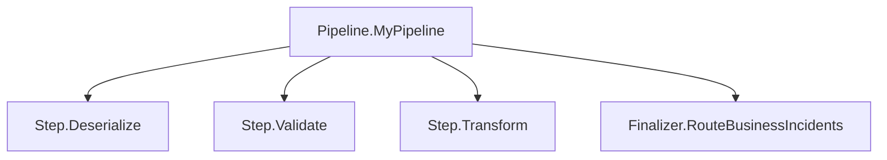

# Observability

> Every step and pipeline gets automatic OpenTelemetry tracing with result classification.

## How it works



The framework creates OpenTelemetry `Activity` spans at two levels: one for the entire pipeline and one for each individual step. Spans are created automatically — you don't need to add any tracing code to your step implementations.

## Pipeline-level tracing

Wrap any pipeline with `PipelineTracing.ExecuteWithTracing` to create a parent span:

```csharp
var (result, context) = await PipelineTracing.ExecuteWithTracing(
    pipeline: () => Pipeline.Start(input, ctx)
        .AddStep(step1)
        .AddStep(step2)
        .AddFinalizer(finalizer),
    pipelineName: "order-pipeline",
    logger: logger);
```

The pipeline span:

- Name: `Pipeline.{pipelineName}`
- Tag: `pipeline.name` = the pipeline name
- Status: `Ok` on success/cancelled/business failure, `Error` on technical failure
- Logs technical failures via the provided `ILogger`

The Block pipelines (`SendPipeline`, `ReceivePipeline`, `Extractor`) use `ExecuteWithTracing` internally — you get pipeline-level tracing automatically.

### Detached traces

By default, the pipeline span is a child of the current activity. Set `detachTrace: true` to create a new root span linked to the parent instead:

```csharp
var (result, context) = await PipelineTracing.ExecuteWithTracing(
    pipeline: () => myPipeline(),
    pipelineName: "order-pipeline",
    logger: logger,
    detachTrace: true);
```

This is useful when you want a separate trace for each pipeline execution while preserving the causal link to the parent.

## Step-level tracing

Every step creates its own `Activity` span inside `ExecuteAsyncInternal`, which wraps your `ExecuteAsync` method. This happens automatically for all step types.

### Step spans

- Name: `Step.{StepName}`
- Tags:
    - `step.name` = the step's `StepName` property
    - `step.result` = one of `success`, `cancelled`, `business_failure`, `technical_failure`
    - `step.business_failure_message` = description (on business failure)
    - `step.technical_failure_message` = description (on technical failure)
- Status: `Ok` for all results except `technical_failure`, which sets `Error`

### Finalizer spans

- Name: `Finalizer.{FinalizerName}`
- Tags:
    - `finalizer.name` = the finalizer's `FinalizerName` property
    - `finalizer.triggers` = the configured trigger flags (e.g., `OnSuccess, OnBusinessFailure`)
    - `finalizer.output_result` = the result type after finalizer execution
- Status: same as step spans

## Exception handling and tracing

When an uncaught exception occurs in a step:

1. The span status is set to `Error`
2. The exception is added to the span via `AddException`
3. The exception is converted to the appropriate failure type:
    - `Step` and `TechnicalStep`: becomes `TechnicalFailure`
    - `BusinessStep`: becomes `BusinessIncident`

This means you can find failed steps in your tracing backend by filtering on `status = Error` or by looking at the `step.result` tag.

## Activity sources

The framework uses separate `ActivitySource` instances for each package:

| Package | ActivitySource |
|---------|---------------|
| Core | Used for pipeline and step spans |
| Blocks | Used for block-level operations |
| Adapters | Used for file adapter operations |

To collect traces, subscribe to these activity sources in your OpenTelemetry configuration.

## Practical implications

- You don't need to add tracing code to your steps — the framework handles it.
- Use `StepName` and `FinalizerName` properties to give your steps meaningful names that appear in traces.
- Technical failures show as `Error` status in your tracing backend; business failures show as `Ok` status with a `step.result = business_failure` tag. This distinction lets you set up different alerting rules for each.
- The `pipeline.name` tag on the root span lets you filter and group traces by integration pipeline.

## Related

- [Pipeline Execution](pipeline-execution.md) — how steps chain together
- [Pipeline](../core/pipeline.md) — `PipelineTracing.ExecuteWithTracing` signature
