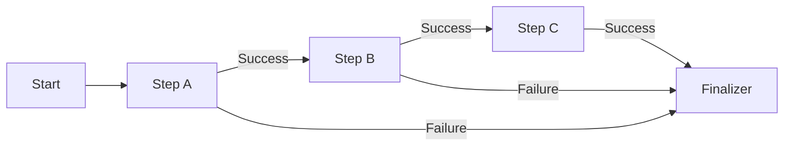
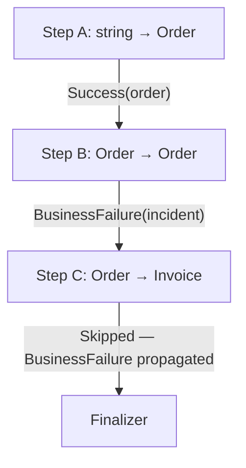

# Pipeline Execution

> The pipeline engine chains typed steps together using extension methods, propagating failures automatically.

## How it works



A pipeline starts with `Pipeline.Start(value, context)`, which wraps the initial value as a `StepResult<T>.Success`. Each subsequent call to `.AddStep(step)` is an extension method on `Task<(StepResult<T> Result, TCtx Context)>`. The compiler enforces that the output type of one step matches the input type of the next.

Steps only execute when the previous result is `Success`. If any step returns `Cancelled`, `BusinessFailure`, or `TechnicalFailure`, the failure propagates through all remaining steps unchanged — they are skipped without execution. Finalizers are the exception: they run conditionally based on their `FinalizerTrigger` flags.

## Building a pipeline

The pipeline API is a chain of extension methods. There is no configuration object or runtime pipeline builder — the pipeline shape is determined at compile time:

```csharp
var (result, context) = await Pipeline.Start(inputValue, myContext)
    .AddStep(new DeserializeStep())
    .AddStep(new ValidateStep())
    .AddStep(new TransformStep())
    .AddFinalizer(new CleanupFinalizer());
```

The generic type parameters flow through the chain: if `DeserializeStep` is `Step<string, Order, MyContext>` and `ValidateStep` is `Step<Order, Order, MyContext>`, the compiler checks that `Order` matches at the boundary. A type mismatch is a compile error.

## Failure propagation

When a step returns a non-success result, the pipeline wraps it in the appropriate result type for the next step's output type and passes it through:



The context from the last step that actually executed is preserved. Steps that are skipped don't modify the context.

## Adding multiple same-typed steps

Use `AddSteps` when you have multiple steps with the same input and output type (e.g., multiple extract or validation steps):

```csharp
var extractors = new List<BusinessStep<Order, Order, Context>>
{
    new EnrichWithCustomerData(),
    new EnrichWithPricingData()
};

var (result, context) = await Pipeline.Start(order, myContext)
    .AddSteps(extractors)  // executes in order, short-circuits on failure
    .AddStep(new TransformStep());
```

`AddSteps` is available for both `BusinessStep<T, T, TCtx>` and `TechnicalStep<T, T, TCtx>` collections. Steps execute in order and short-circuit on the first failure.

## Finalizers

Finalizers run conditionally based on `FinalizerTrigger` flags. Unlike regular steps, a finalizer receives the full `StepResult<T>` — not just the success value — so it can inspect and act on failures:

```csharp
public class NotificationFinalizer : Finalizer<string, Context>
{
    public override string FinalizerName => "Notify";

    public override FinalizerTrigger Triggers =>
        FinalizerTrigger.OnSuccess | FinalizerTrigger.OnBusinessFailure;

    public override Task<(StepResult<string> Result, Context Context)> ExecuteAsync(
        StepResult<string> result, Context context)
    {
        // Runs on success AND business failure, but not on cancelled or technical failure
        return Task.FromResult((result, context));
    }
}
```

The available triggers are flags that can be combined:

| Flag | Runs when |
|------|-----------|
| `FinalizerTrigger.OnSuccess` | Pipeline completed successfully |
| `FinalizerTrigger.OnCancelled` | Pipeline was cancelled (idempotency) |
| `FinalizerTrigger.OnBusinessFailure` | A business step returned a failure |
| `FinalizerTrigger.OnTechnicalFailure` | A technical failure occurred |

!!! info "Business failure preservation"
    If a finalizer produces a new `BusinessFailure`, the pipeline preserves the
    **first** business failure that occurred. This prevents finalizers from
    accidentally overwriting the original failure reason.

## Tracing

Every pipeline can be wrapped with OpenTelemetry tracing using `PipelineTracing.ExecuteWithTracing`:

```csharp
var (result, context) = await PipelineTracing.ExecuteWithTracing(
    pipeline: () => Pipeline.Start(input, ctx)
        .AddStep(step1)
        .AddStep(step2),
    pipelineName: "my-pipeline",
    logger: logger);
```

This creates a parent Activity span for the entire pipeline. Each step also creates its own child span with `step.name` and `step.result` tags. See [Observability](observability.md) for details.

## Practical implications

- You don't need to add null checks or failure guards between steps — the pipeline engine handles propagation.
- If you need a step to run regardless of the previous result, make it a `Finalizer` with the appropriate trigger flags.
- Steps are stateless: they receive input and context, and return a result and (potentially modified) context. State sharing happens through the `Context.Metadata` dictionary.

## Related

- [Result Types](result-types.md) — the four result variants and when to use each
- [Step Types](step-types.md) — choosing between Step, BusinessStep, TechnicalStep, and Finalizer
- [Pipeline API Reference](../core/pipeline.md) — exact method signatures
