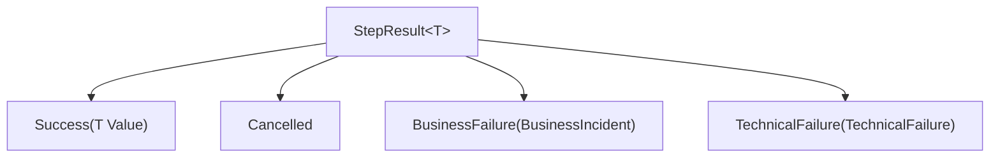

# Result Types

> Every step returns a discriminated union result that separates success, cancellation, business failure, and technical failure.

## How it works



`StepResult<T>` is the pipeline's universal result type. Every step in the pipeline produces a `StepResult<T>`, either directly (for `Step<TIn, TOut, TCtx>`) or through automatic conversion from the step-specific result types. The four variants force explicit handling of every outcome — you cannot accidentally ignore a failure.

## StepResult\<T\>

The top-level result type that flows through the pipeline:

```csharp
public abstract record StepResult<T>
{
    public sealed record Success(T Value) : StepResult<T>;
    public sealed record Cancelled : StepResult<T>;
    public sealed record BusinessFailure(BusinessIncident Value) : StepResult<T>;
    public sealed record TechnicalFailure(Failures.TechnicalFailure Value) : StepResult<T>;
}
```

| Variant | Meaning | Pipeline behavior |
|---------|---------|-------------------|
| `Success` | Step completed with a value | Next step executes |
| `Cancelled` | Already processed (idempotency) | Remaining steps are skipped |
| `BusinessFailure` | Domain-level problem (bad data, validation failure) | Remaining steps are skipped |
| `TechnicalFailure` | Infrastructure problem (network, database, timeout) | Remaining steps are skipped |

## BusinessStepResult\<T\>

The return type for `BusinessStep<TIn, TOut, TCtx>`. It has three variants — no `TechnicalFailure`:

```csharp
public abstract record BusinessStepResult<T>
{
    public sealed record Success(T Value) : BusinessStepResult<T>;
    public sealed record Cancelled : BusinessStepResult<T>;
    public sealed record Failure(BusinessIncident Value) : BusinessStepResult<T>;
}
```

The pipeline automatically converts this to `StepResult<T>` after execution. If an uncaught exception occurs in a `BusinessStep`, it is converted to a `BusinessIncident` — not a `TechnicalFailure`.

## TechnicalStepResult\<T\>

The return type for `TechnicalStep<TIn, TOut, TCtx>`. It has three variants — no `BusinessFailure`:

```csharp
public abstract record TechnicalStepResult<T>
{
    public sealed record Success(T Value) : TechnicalStepResult<T>;
    public sealed record Cancelled : TechnicalStepResult<T>;
    public sealed record Failure(TechnicalFailure Value) : TechnicalStepResult<T>;
}
```

Uncaught exceptions in a `TechnicalStep` become `TechnicalFailure`.

## TechnicalFailure

The payload for technical failures:

```csharp
public record TechnicalFailure(
    string Description,
    string? ErrorMessage = null,
    Exception? Exception = null,
    params object?[]? ErrorMessageArgs);
```

`ErrorMessage` is a structured message template (like `"Failed to connect to {host}"`), and `ErrorMessageArgs` provides the template parameters. The framework uses these for structured logging via `ILogger`.

## BusinessIncident

`BusinessIncident` comes from the `Intropy.Libs.Contracts` package. It represents a domain-level problem that should be routed to the business incident service for visibility and resolution:

```csharp
public record BusinessIncident(
    string Description,
    DateTimeOffset OccurredAt,
    Dictionary<string, string> Context);
```

## Why two failure types?

The separation between business and technical failures drives different operational behaviors:

- **Business failures** are expected. They represent bad data, validation failures, or domain rule violations. They should be visible to integration operators and may require manual intervention to resolve.
- **Technical failures** are unexpected. They represent infrastructure problems like network errors, database unavailability, or timeouts. They typically trigger automatic retries and infrastructure alerts.

The step type (`BusinessStep` vs `TechnicalStep`) determines which failure domain uncaught exceptions fall into. This means you cannot accidentally produce a technical failure from business logic or a business failure from infrastructure code.

## Pattern matching results

Use C# pattern matching to handle results:

```csharp
var (result, context) = await pipeline;

var message = result switch
{
    StepResult<string>.Success s => $"Processed: {s.Value}",
    StepResult<string>.Cancelled => "Already processed (idempotent)",
    StepResult<string>.BusinessFailure bf => $"Business issue: {bf.Value.Description}",
    StepResult<string>.TechnicalFailure tf => $"Technical error: {tf.Value.Description}",
    _ => throw new InvalidOperationException("Unknown result type")
};
```

## Practical implications

- Return `BusinessStepResult<T>.Failure` for problems the business should know about (invalid orders, missing required fields, data format violations).
- Return `TechnicalStepResult<T>.Failure` for problems the infrastructure team should know about (API timeouts, connection failures, serialization errors in infrastructure code).
- Return `Cancelled` when idempotency checks detect a duplicate. The pipeline will skip all remaining steps.
- You can let exceptions propagate — the step wrapper will catch them and convert them to the appropriate failure type based on the step class.

## Related

- [Step Types](step-types.md) — how step types determine the failure domain
- [Pipeline Execution](pipeline-execution.md) — how results propagate through the pipeline
- [Results](../core/results.md) — exact type signatures
