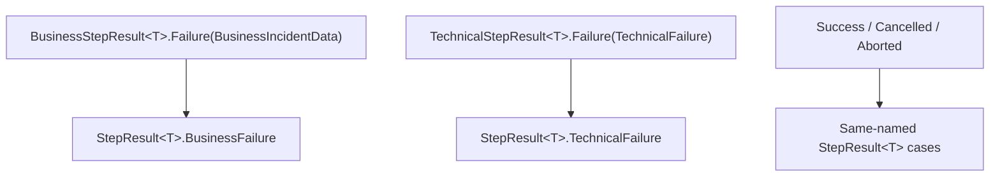

# Result Types

> Failure classification, logical cancellation, and execution abortion are separate outcomes.

## Step results and pipeline results

Business and technical steps return different result families so their `Failure` cases require different payloads. The pipeline converts them to one result family that can represent either failure domain:

`StepResult<T>` has five nested cases: `Success`, `Cancelled`, `BusinessFailure`, `TechnicalFailure`, and `Aborted`. Each step-level family has four: `Success`, `Cancelled`, `Failure`, and `Aborted`. See [Results](../core/results.md) for declarations, payload construction, and pattern matching.

A non-success result skips subsequent ordinary steps. Finalizers are selected separately and may change the result. The result records do not themselves publish incidents or schedule retries.

## Why two failure domains?

A business failure represents a problem to surface through business-incident handling, such as an invalid order. A technical failure represents a problem to propagate to the caller or runtime, such as a failed queue publish.

The step's base class determines how ordinary uncaught exceptions are classified; the framework does not inspect an exception and infer whether retry would help. A network exception inside a business step therefore becomes a business failure. A deterministic transformation bug inside a technical step becomes a technical failure, even though retrying unchanged code and input may fail again.

For named block steps, this classification is already chosen. In particular, Transactional Integration's `SendStep` is business, while Extractor's and Loader's `SendStep` are technical. Use the [block-specific matrix](step-types.md#block-step-abstractions), not the unqualified step name, to choose a return type. These are the implemented classifications; the source does not establish a universal design rationale for every assignment.

## Cancelled versus Aborted

- **`Cancelled`** is a logical stop, used by idempotency checks for an already-processed message. It does not mean the cancellation token was signalled.
- **`Aborted`** represents execution abortion. The pipeline wrappers produce it when the token is already signalled, or when an `OperationCanceledException` escapes while the token is signalled.

Both skip subsequent ordinary steps. Finalizer selection uses `OnCancelled` and `OnAborted`, respectively. A signalled token prevents a finalizer body from running even if its trigger matches; see the [finalizer contract](../core/steps.md).

## Incident routing and broker retry

There are three separate decisions: the step classifies a failure, a configured finalizer handles the result, and the host decides how to acknowledge the message.

For the built-in business-incident router and **Transactional Integration job subscriber** at this documentation revision:

1. A business step returns `Failure(BusinessIncidentData)`. The pipeline converts it to `StepResult<T>.BusinessFailure` and skips the remaining ordinary steps.
2. If configured, `ExternalBusinessIncidentRouter` calls the Business Incident Service. Successful incident creation converts the result to `Success` with the router's default output value. This success means **handled**, not that the skipped delivery steps ran.
3. A `BusinessIncidentServiceException` during routing produces `TechnicalFailure`. Other uncaught router exceptions are also classified as technical by the finalizer wrapper.
4. The subscriber returns Dapr `Retry` for a final `TechnicalFailure` **or an unhandled `BusinessFailure`**. It returns Dapr `Success` for the other cases, including `Cancelled` and, currently, `Aborted`.

| Final result observed by this subscriber | Dapr response |
|---|---|
| `Success` (including a successfully routed incident) | `Success` |
| `Cancelled` | `Success` |
| `BusinessFailure` still present | `Retry` |
| `TechnicalFailure` | `Retry` |
| `Aborted` | `Success` |

An exception escaping message processing also requests retry. Actual redelivery depends on the broker/Dapr policy. This table describes the subscriber's implementation, not a recommended cancellation policy or a guarantee for every host.

Thus, “business failures consume the message; technical failures retry” is only a shorthand for a pipeline with **successful incident routing**. A raw `BusinessFailure` is not automatically acknowledged. Extractor and Loader callers, custom hosts, and the transactional receive loop have their own handling; the Core pipeline engine does not prescribe broker behavior.

## Source and related reference

- [ExternalBusinessIncidentRouter.cs](../../src/Intropy.Framework.Blocks/Shared/Steps/External/ExternalBusinessIncidentRouter.cs)
- [MessageSubscriber.cs](../../src/Intropy.Framework.Hosting/TransactionalIntegration/Job/Lifecycle/MessageSubscriber.cs)
- [Step Types](step-types.md) — block-specific failure domains
- [Results](../core/results.md) — exact case and payload reference
- [Implementing pipeline steps](../implementing-pipeline-steps.md) — working example
