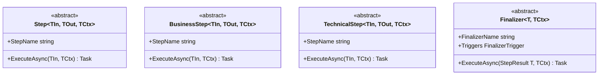

# Step Types

> The framework provides four step base classes, each with a different failure domain and execution model.

## How it works



Every step has a `StepName` (or `FinalizerName`) property for tracing and logging. The framework wraps every `ExecuteAsync` call with OpenTelemetry span creation and exception handling — you implement the abstract method, and the framework handles the rest.

## Step\<TIn, TOut, TCtx\>

The generic step with no predefined failure domain. You return `StepResult<TOut>` directly, giving you full control over which result variant to use. Uncaught exceptions become `TechnicalFailure`.

```csharp
public class MyStep : Step<string, Order, Context>
{
    public override string StepName => "MyStep";

    public override Task<(StepResult<Order> Result, Context Context)> ExecuteAsync(
        string input, Context context)
    {
        var order = JsonSerializer.Deserialize<Order>(input)!;
        return Task.FromResult<(StepResult<Order>, Context)>(
            (new StepResult<Order>.Success(order), context));
    }
}
```

Use `Step<TIn, TOut, TCtx>` when your logic doesn't fit neatly into the business or technical domain, or when you need to return any of the four result variants directly.

## BusinessStep\<TIn, TOut, TCtx\>

A step whose failure domain is "business." You return `BusinessStepResult<TOut>` — which only has `Success`, `Cancelled`, and `Failure(BusinessIncident)`. If an uncaught exception escapes your `ExecuteAsync`, the framework catches it and creates a `BusinessIncident` automatically.

```csharp
public class OrderValidator : BusinessStep<Order, Order, Context>
{
    public override string StepName => "ValidateOrder";

    public override Task<(BusinessStepResult<Order> Result, Context Context)> ExecuteAsync(
        Order input, Context context)
    {
        if (input.Amount <= 0)
        {
            var incident = new BusinessIncident(
                "Invalid order amount",
                DateTimeOffset.UtcNow,
                new Dictionary<string, string> { ["orderId"] = input.OrderId });

            return Task.FromResult<(BusinessStepResult<Order>, Context)>(
                (new BusinessStepResult<Order>.Failure(incident), context));
        }

        return Task.FromResult<(BusinessStepResult<Order>, Context)>(
            (new BusinessStepResult<Order>.Success(input), context));
    }
}
```

Use `BusinessStep` for domain logic: validation, data enrichment, business rule checks, sending to external systems where failure represents a business problem.

## TechnicalStep\<TIn, TOut, TCtx\>

A step whose failure domain is "technical." You return `TechnicalStepResult<TOut>` — which only has `Success`, `Cancelled`, and `Failure(TechnicalFailure)`. Uncaught exceptions become `TechnicalFailure`.

```csharp
public class OrderTransformer : TechnicalStep<Order, Invoice, Context>
{
    public override string StepName => "TransformOrder";

    public override Task<(TechnicalStepResult<Invoice> Result, Context Context)> ExecuteAsync(
        Order input, Context context)
    {
        var invoice = new Invoice(
            InvoiceNumber: $"INV-{input.OrderId}",
            CustomerName: input.CustomerName,
            Total: input.Amount * 1.25m,
            IssuedDate: DateTime.UtcNow);

        return Task.FromResult<(TechnicalStepResult<Invoice>, Context)>(
            (new TechnicalStepResult<Invoice>.Success(invoice), context));
    }
}
```

Use `TechnicalStep` for infrastructure operations: data transformation, serialization, file I/O, idempotency checks.

## Finalizer\<T, TCtx\>

A step that runs conditionally based on the pipeline result. Unlike other steps, it receives the full `StepResult<T>` — not just the success value. The `Triggers` property determines when it executes.

```csharp
public class LoggingFinalizer : Finalizer<string, Context>
{
    public override string FinalizerName => "LogResult";

    public override FinalizerTrigger Triggers =>
        FinalizerTrigger.OnSuccess | FinalizerTrigger.OnBusinessFailure | FinalizerTrigger.OnTechnicalFailure;

    public override Task<(StepResult<string> Result, Context Context)> ExecuteAsync(
        StepResult<string> result, Context context)
    {
        // Log the result, send notifications, clean up resources
        return Task.FromResult((result, context));
    }
}
```

Finalizers are added to the pipeline with `.AddFinalizer()` instead of `.AddStep()`.

!!! tip "Returning results from finalizers"
    Finalizers can modify the result — for example, converting a `BusinessFailure`
    to `Success` after handling it. But if a finalizer produces a new
    `BusinessFailure`, the pipeline preserves the first one to prevent accidental
    overwriting.

## Block step abstractions

The Blocks package provides pre-named step abstractions for common integration patterns. These extend the core step types with fixed `StepName` values and constrain `TCtx : Context`:

### Send pipeline steps

| Abstract class | Base class | Input → Output |
|---|---|---|
| `DeserializeStep<TInput, TCtx>` | `BusinessStep<ReadOnlyMemory<byte>, TInput, TCtx>` | Raw bytes → typed object |
| `ExtractStep<TInput, TCtx>` | `BusinessStep<TInput, TInput, TCtx>` | Enrichment (same type in/out) |
| `ValidateStep<T, TCtx>` | `BusinessStep<T, T, TCtx>` | Validation (same type in/out) |
| `TransformStep<TInput, TOutput, TCtx>` | `TechnicalStep<TInput, TOutput, TCtx>` | Type conversion |
| `SerializeStep<T, TCtx>` | `TechnicalStep<T, string, TCtx>` | Typed object → string |
| `SendStep<TCtx>` | `BusinessStep<string, string, TCtx>` | Send to destination |

### Receive pipeline steps

| Abstract class | Base class | Input → Output |
|---|---|---|
| `ReceiveStep<TCtx>` | `BusinessStep<SourceItemInfo, SourceItem, TCtx>` | Read source item content |
| `EnqueueStep<TCtx>` | `TechnicalStep<SourceItem, SourceItem, TCtx>` | Publish to message queue |
| `CompleteStep<TCtx>` | `BusinessStep<SourceItem, SourceItem, TCtx>` | Cleanup after enqueue |

### Extractor steps

| Abstract class | Base class | Input → Output |
|---|---|---|
| `DeserializeStep<TInput, TCtx>` | `BusinessStep<string, TInput, TCtx>` | String → typed object |
| `ExtractStep<TInput, TCtx>` | `BusinessStep<TInput, TInput, TCtx>` | Enrichment (same type in/out) |
| `ValidateStep<T, TCtx>` | `BusinessStep<T, T, TCtx>` | Validation (same type in/out) |
| `TransformStep<TInput, TOutput, TCtx>` | `TechnicalStep<TInput, TOutput, TCtx>` | Type conversion |
| `SerializeStep<T, TCtx>` | `TechnicalStep<T, CloudEvent, TCtx>` | Typed object → CloudEvent |
| `SendStep<TCtx>` | `TechnicalStep<CloudEvent, CloudEvent, TCtx>` | Publish CloudEvent |

!!! warning "Namespace differences"
    The Send pipeline and Extractor have separate step abstractions in different
    namespaces. `DeserializeStep` in the Send pipeline takes `ReadOnlyMemory<byte>`,
    while in the Extractor it takes `string`. Import the correct namespace for your
    block type.

## Choosing a step type

| Use this | When |
|----------|------|
| `BusinessStep` | Your logic validates data, applies business rules, or sends to external systems where failures represent business problems |
| `TechnicalStep` | Your logic transforms data, serializes/deserializes, or performs infrastructure operations |
| `Step` | You need full control over the result type (rare — prefer BusinessStep or TechnicalStep) |
| `Finalizer` | Your logic should run regardless of the pipeline result (cleanup, notifications, incident routing) |

## Related

- [Result Types](result-types.md) — the result types each step produces
- [Pipeline Execution](pipeline-execution.md) — how steps chain together
- [Steps](../core/steps.md) — exact signatures
