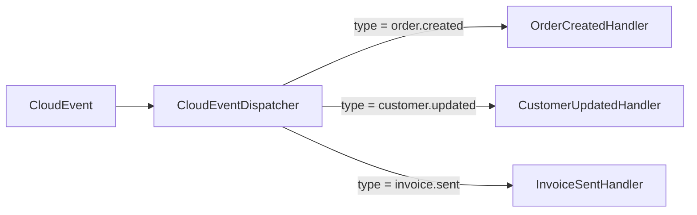

# Event Dispatcher

> Type-safe CloudEvent routing to handlers based on event type attributes.

**Assembly:** `Intropy.Framework.EventDispatcher`

## Overview

The Event Dispatcher provides attribute-based routing of CloudEvents to typed handler classes. You decorate handler classes with `[CloudEventType("...")]`, implement `ICloudEventHandler<TData>`, and the dispatcher automatically deserializes the event data and invokes the correct handler.

Handlers are discovered by scanning assemblies at startup and registered in the DI container. At runtime, `CloudEventDispatcher` looks up the handler for an incoming event's type, resolves it from DI, deserializes the data, and calls `HandleAsync`.



## Installation

```bash
dotnet add package Intropy.Framework.EventDispatcher
```

## Quick example

Define a handler:

```csharp
[CloudEventType("com.company.order.created")]
public class OrderCreatedHandler : ICloudEventHandler<OrderData>
{
    public Task HandleAsync(OrderData data, CloudEvent cloudEvent, CancellationToken ct = default)
    {
        // Handle the event
        return Task.CompletedTask;
    }
}
```

Register handlers and dispatch events:

```csharp
// Registration
builder.Services.AddCloudEventHandlers(typeof(OrderCreatedHandler).Assembly);

// Dispatching (e.g., in an endpoint or subscriber)
app.MapPost("/events", async (CloudEvent cloudEvent, CloudEventDispatcher dispatcher, CancellationToken ct) =>
{
    await dispatcher.DispatchAsync(cloudEvent, ct);
    return Results.Ok();
});
```
